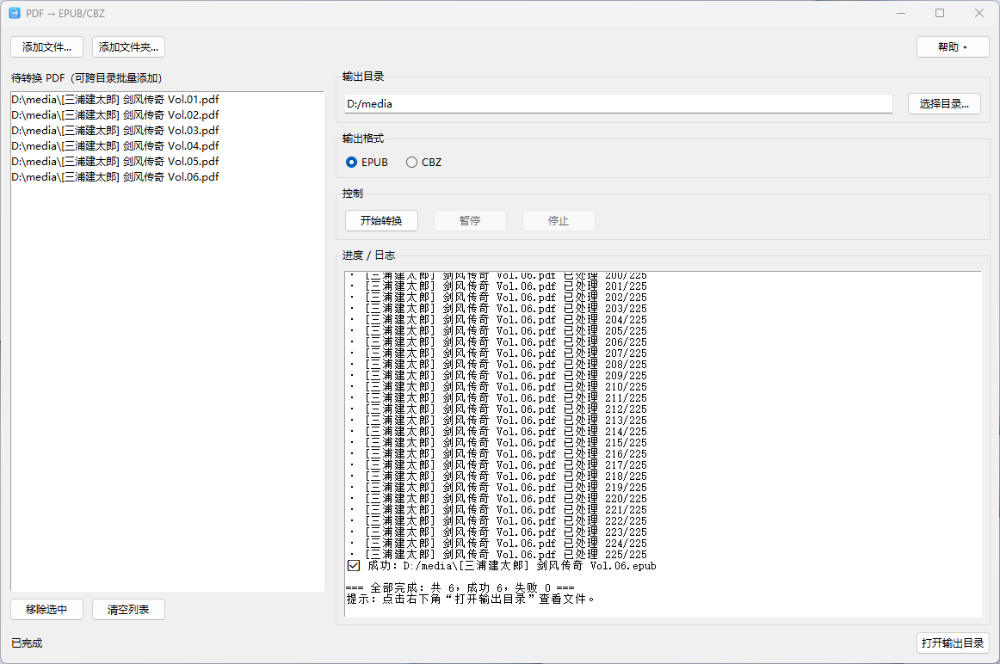

# pdf2epub



一个简单的 PDF 转 EPUB 转换工具，带图形化界面。  
支持漫画类 PDF 转换为 EPUB/CBZ，保持原始图片清晰度。  
支持Windows和macOS

---

## 下载
请前往 [Releases](../../releases) 页面下载最新版本。  
提供以下版本可选：

### 1. Windows 版
- pdf2epub_v2.2_win-x64.exe
- 下载后直接双击运行

### 2. macOS 版
- 提供 Intel 与 Apple Silicon (M 系列) 两个版本：  
  - `pdf2epub-2.2-mac-intel.zip`  
  - `pdf2epub-2.2-mac-arm64.zip`  
- 下载后解压，得到 `pdf2epub.app`，双击即可运行  
- **注意**：首次运行可能需要在「系统设置 → 隐私与安全性」中允许打开  

---

## 使用方法
1. 打开程序  
2. 选择需要转换的 PDF 文件  
3. 点击开始转换，生成 EPUB 文件  
4. 若想转换 CBZ 格式，则勾选输出模式为 CBZ 后点击开始转换  

---

## 注意事项
- 本工具基于 **Python + PyInstaller** 打包  
- 转换结果取决于 PDF 本身（主要适用于图片型 PDF，例如漫画）  
- Windows 版为单文件形式，首次启动可能稍慢  
- macOS 版请根据 CPU 架构选择对应的 Intel 或 M 系列版本  
- 若 macOS 提示“应用已损坏/无法打开”，可通过以下方式解决：  
  1. 打开「系统设置 → 隐私与安全性」允许运行  
  2. 或在终端执行：  
     ```bash
     xattr -cr /路径/pdf2epub.app
     ```
     
---
